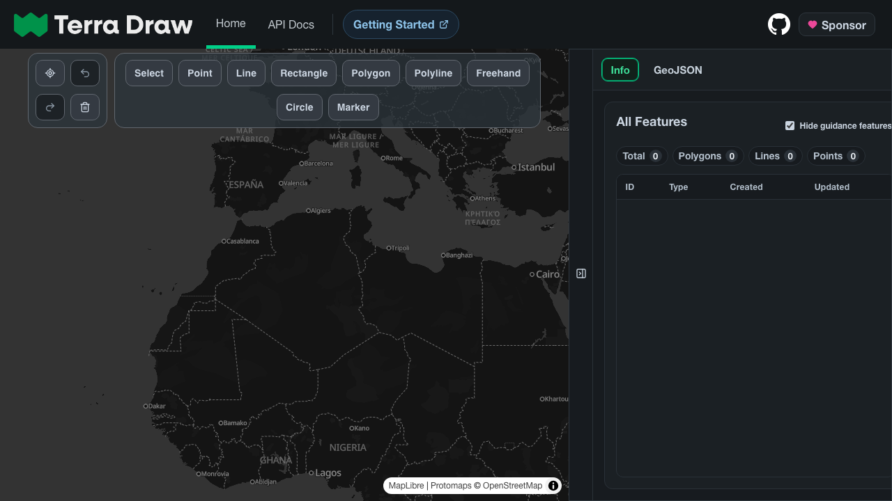
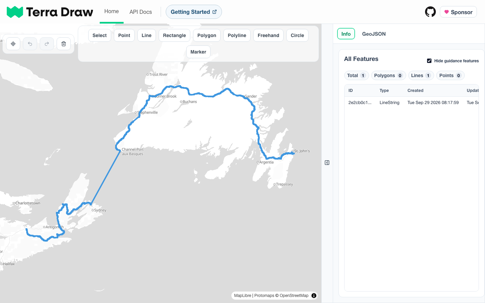
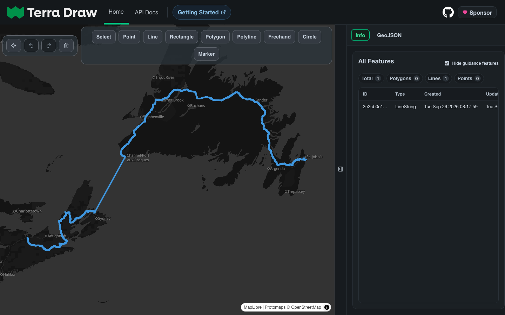

# Terra Draw Website

The official [Terra Draw](https://www.github.com/JamesLMilner/terra-draw) website repository, live at [terradraw.io](https://terradraw.io). A static Preact + Vite site that doubles as an interactive demo of the library.

## Automatic light and dark

The UI and map basemap follow the browser/OS light/dark preference automatically, with no toggle.

|          | Light | Dark |
| -------- | ----- | ---- |
| **Home** |  |  |
| **Demo** |  |  |

*The demo row shows the app loaded with a real multi-day route: one GeoJSON LineString spanning Atlantic Canada, listed in the Info panel.*

## Requirements

- Node.js 24 (CI pins `24.18.0`)
- npm 11

## Installation

```bash
npm ci
```

## Running Locally

```bash
npm run dev
```

The dev server runs at [http://localhost:5173](http://localhost:5173) over HTTP. Browsers treat `localhost` as a secure context, so the geolocation button works locally.

## Testing

For tests, install the Playwright browser first:

```bash
npx playwright install --with-deps chromium
```

See [`documentation/5.testing.md`](documentation/5.testing.md) for the full testing guide.

## Scripts

| Command             | Description                                                  |
| ------------------- | ------------------------------------------------------------ |
| `npm run dev`       | Start the Vite dev server at `http://localhost:5173`         |
| `npm run typecheck` | Type-check with `tsc --noEmit`                               |
| `npm run build`     | Build the static site into `docs/` and write `docs/CNAME`    |
| `npm run lint`      | Lint `src/` with ESLint                                      |
| `npm test`          | Run the Playwright test suite (builds and previews the site) |

## Further Reading

- [Documentation index](documentation/README.md) — getting started, architecture, map internals, export, testing and deployment.

## License

[MIT Licensed](./LICENSE)
