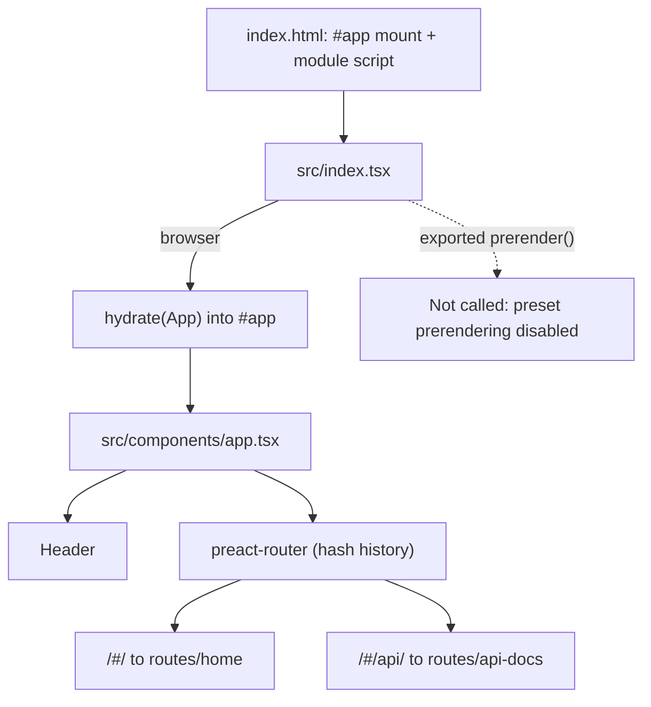

# Architecture

> A static, client-rendered Preact single-page app built with Vite and deployed to GitHub Pages. There is no backend.

## Stack at a Glance

| Layer         | Choice                                                                          |
| ------------- | ------------------------------------------------------------------------------- |
| UI runtime    | Preact 10 with TypeScript, classic JSX (`h`)                                    |
| Build         | Vite 8 + `@preact/preset-vite`, output to `docs/`                               |
| Routing       | `preact-router` with `history`'s `createHashHistory`                            |
| Map           | MapLibre GL 6, keyless OpenFreeMap basemaps (`positron`/`dark`), `terra-draw-maplibre-gl-adapter` |
| Drawing       | `terra-draw` 1.31.0 (pinned)                                                    |
| Measurement   | `@turf/area`, `@turf/length`                                                    |
| Export        | JSON via Blob; FlatGeobuf via lazy dynamic import                              |
| Styling       | Global CSS with `light-dark()` theme tokens plus per-component CSS Modules; no framework or preprocessor |
| Tests         | Playwright (Chromium only)                                                      |
| Lint/type     | ESLint 10 flat config, TypeScript 6 strict (`noEmit`)                           |

## Runtime Dependencies

| Package                              | Version   | Used for in this project                                                                 |
| ------------------------------------ | --------- | ---------------------------------------------------------------------------------------- |
| `preact`                             | ^10.29.7  | UI runtime; every `.tsx` imports `h`                                                     |
| `preact-router`                      | ^4.1.2    | The actual router in [`app.tsx`](../src/components/app.tsx); `match` for active nav links |
| `history`                            | ^5.3.0    | `createHashHistory()` supplied to the router                                             |
| `preact-iso`                         | ^2.12.0   | Only `hydrate` is used ([`index.tsx:7-9`](../src/index.tsx)) — it is *not* the router     |
| `preact-render-to-string`            | ^6.7.0    | Dependency of the prerender path, which is currently never executed (see quirks)          |
| `maplibre-gl`                        | ^6.0.0    | Map renderer; styles and RTL/worker setup live in the home route                          |
| `terra-draw`                         | 1.31.0    | Drawing engine — exact pin, not a caret range                                             |
| `terra-draw-maplibre-gl-adapter`     | 1.4.1     | Bridges Terra Draw to the MapLibre map — exact pin                                        |
| `lucide-preact`                      | ^1.7.0    | Icons in the header, toolbar, panel and download buttons                                  |
| `@turf/area`, `@turf/length`         | ^7.3.5    | Polygon area and line length; re-exported by [`utils/geo.ts`](../src/utils/geo.ts)        |
| `flatgeobuf`                         | ^3.33.0   | FlatGeobuf serialisation, dynamically imported only when downloading an `.fgb`            |
| `@types/geojson`                     | ^7946.0.10 | Types only (`FeatureCollection` in the GeoJSON tab); misfiled under `dependencies`       |

Development dependencies of note: `vite` ^8.1.5, `@preact/preset-vite` ^2.10.5, `typescript` ^6.0.3, `eslint` ^10.7.0 with `@typescript-eslint` ^8.63.0, `globals` ^17.7.0 and `@playwright/test` ^1.54.2. There is no Prettier, no SCSS and no test runner for unit tests.

## Rendering Pipeline

[`index.html`](../index.html) mounts `#app` (`index.html:19`) and loads [`src/index.tsx`](../src/index.tsx) as a module script marked with the `prerender` attribute (`index.html:20`). The entry imports the theme and global stylesheets, then calls `hydrate(<App />, ...)` in the browser (`src/index.tsx:7-9`); [`src/components/app.tsx`](../src/components/app.tsx) renders the header and the router.

> [!IMPORTANT]
> **Prerendering is currently disabled.** [`index.html:20`](../index.html) and the exported `prerender()` in [`src/index.tsx:11-13`](../src/index.tsx) are scaffolding only: [`vite.config.ts:6`](../vite.config.ts) calls `preact()` without options, and `@preact/preset-vite` defaults its `prerender` option to `{ enabled: false }`, so the prerender plugin is never registered. Every build therefore emits an empty `#app` shell and all rendering happens client-side via `hydrate`. Enabling it would currently fail in Node, because `createHashHistory()` needs `window` ([`app.tsx:13`](../src/components/app.tsx)) and the home route reads `localStorage` during render ([`home/index.tsx:36`](../src/routes/home/index.tsx)).

## Routing

Routing uses **hash history**, so real URLs are `/#/` (the map demo) and `/#/api/` (the embedded API docs), declared in [`app.tsx:13-16`](../src/components/app.tsx). Hash routing is what allows deep links to work on GitHub Pages without server rewrite rules. The API route renders an `<iframe>` pointing at the externally generated TypeDoc site ([`api-docs/index.tsx:6-10`](../src/routes/api-docs/index.tsx)); API docs are not built in this repo.

> [!NOTE]
> The header links to `/api` ([`Header.tsx:16`](../src/components/header/Header.tsx)) while the route is declared as `/api/`. This is cosmetic: preact-router strips leading and trailing slashes before segment matching, so both forms resolve to the same route.

`<App />` renders `
` ([`app.tsx:11`](../src/components/app.tsx)) inside the `#app` element from `index.html:19`, so the runtime DOM contains nested elements with the same `id`. Harmless in practice, but worth knowing when querying by ID or writing selectors.

## Component and Directory Conventions

- **Components** live in `src/components/<name>/` as a `PascalCase.tsx` file with a colocated `style.module.css`.
- **Composables** are `useXxx.ts` files next to their consumer (for example [`useDownloadJSON.ts`](../src/components/geojson-tab/useDownloadJSON.ts)); there is no global composables directory.
- **Routes** are `src/routes/<name>/index.tsx` with route-local helpers as siblings (for example [`home/setup-draw.ts`](../src/routes/home/setup-draw.ts), [`home/store-local-storage.ts`](../src/routes/home/store-local-storage.ts)).
- **Shared helpers** live in [`src/utils/`](../src/utils/).
- **Assets** live in [`src/assets/`](../src/assets/) and are imported directly for Vite to hash.

Every `.tsx` file imports `h` from `preact` because the classic JSX runtime is configured (`jsxFactory: "h"`); ESLint exempts `h` from the unused-vars rule for the same reason.

## Styling

- [`src/style/theme.css`](../src/style/theme.css) is the single palette file, imported first by the entry ([`index.tsx:1-2`](../src/index.tsx)). It sets `color-scheme: light dark` on `:root` and defines 49 role tokens as `light-dark(<light>, <dark>)` pairs — including five `--color-map-control-*` tokens for chrome that sits on the basemap — so the browser resolves each colour from the `prefers-color-scheme` setting with no JavaScript.
- [`src/style/index.css`](../src/style/index.css) holds global resets, font and the page background/text, consumed from tokens ([`index.css:6,9`](../src/style/index.css)).
- Per-component presentation is CSS Modules (`import style from "./style.module.css"`), typed by the `*.css` declaration in [`declaration.d.ts:1-4`](../src/declaration.d.ts). Vite hashes and scopes these classes at build time.
- Eight component and route CSS Modules reference tokens with `var(--color-*)`. Colour literals remain only for theme-neutral values — brand greens, the pink heart, accent glows and black shadows.
- MapLibre's stylesheet is imported by the map route ([`home/index.tsx:3`](../src/routes/home/index.tsx)), so it is code-split with that route.
- No CSS framework or preprocessor is used. `index.html` still loads Leaflet CSS (`index.html:13-14`), which is legacy — see quirks.

### Theming

The site has no theme toggle; it follows the browser/OS preference automatically.

- **Adding a token.** Add a `--color-*: light-dark(<light>, <dark>)` declaration to `:root` in [`theme.css`](../src/style/theme.css), then reference it with `var(--color-*)`. Set the light value to exactly the literal the element used before: every distinct light value keeps its own token (near-duplicate neutrals are intentionally not consolidated), so light mode stays byte-identical to the pre-theming build. [`dark-mode.spec.ts`](../tests/e2e/dark-mode.spec.ts) pins that guarantee with exact computed-colour assertions.
- **Header marks.** Under `prefers-color-scheme: dark`, the logo is inverted and hue-rotated and the GitHub mark is turned white ([`header/style.module.css:184-192`](../src/components/header/style.module.css)).
- **Map basemap.** The map loads a keyless OpenFreeMap style up front from the preference — `positron` for light (`tiles.openfreemap.org/styles/positron`) and the dark style for dark (`tiles.openfreemap.org/styles/dark`) — then swaps styles live when it changes; both styles, their vector tiles, glyphs and sprites come from `tiles.openfreemap.org`. See [Map and drawing](3.map-and-drawing.md#automatic-theming) for the `transformStyle` carry-over that keeps Terra Draw's `td-*` layers.
- **Map controls.** The floating map toolbar uses dedicated `--color-map-control-surface`, `--color-map-control-surface-translucent`, `--color-map-control-surface-disabled`, `--color-map-control-border` and `--color-map-control-border-soft` tokens instead of the page-chrome tokens, because it sits on the basemap rather than the page background. The light values mirror the page tokens, so light mode is unchanged; the dark values are lifted slate so the controls stay visible over the OpenFreeMap dark basemap. [`dark-mode.spec.ts`](../tests/e2e/dark-mode.spec.ts) pins this with a contrast regression: the strongest button edge must reach 3:1 against the dark style's `#0c0c0c` background, the weaker of surface/border 1.5:1, and the label 4.5:1 on its own surface.
- **API iframe.** `color-scheme` propagates into the cross-origin TypeDoc iframe and TypeDoc supports dark natively, so `/#/api/` renders dark without any per-iframe styling.
- **Baseline.** `light-dark()` is Baseline 2024 (Chrome/Edge 123+, Firefox 120+, Safari 17.5+).

## TypeScript Configuration

[`tsconfig.json`](../tsconfig.json) highlights:

- `strict: true`, `noEmit: true`, `target: es2018`, `module: ESNext`, `moduleResolution: bundler`, `esModuleInterop: true`.
- `jsx: "react"` with `jsxFactory: "h"` and `jsxFragmentFactory: "Fragment"` — classic Preact JSX, hence the required `h` imports.
- Path aliases map `react` and `react-dom` to `preact/compat` ([`tsconfig.json:36-46`](../tsconfig.json)); `@preact/preset-vite` applies the same aliases (plus `react/jsx-runtime` and `react-dom/test-utils`) at bundle time. No React package is installed.
- `allowJs: true`, but `checkJs` is off, so [`src/sw.js`](../src/sw.js) is in the program without being type-checked.
- `include` is `src/**/*` only — `vite.config.ts`, `playwright.config.ts` and the Playwright specs are not type-checked by `npm run typecheck`.

## Known Quirks and Tech Debt

1. **Prerender scaffolding is inert.** The `prerender` attribute and exported `prerender()` do nothing because the preset option is disabled (see above). Either enable it and make the app Node-safe, or remove the dead scaffolding.
2. **Dead PWA service worker.** [`src/sw.js`](../src/sw.js) imports from `preact-cli/sw/`, but `preact-cli` is not a dependency and no code registers a service worker. PWA precaching is non-functional.
3. **Unused PWA manifest.** [`src/manifest.json`](../src/manifest.json) is never linked from `index.html` and is not referenced anywhere; install metadata has no effect.
4. **Stale size artefact.** [`size-plugin.json`](../size-plugin.json) holds output from the preact-cli size plugin (timestamps from 2024). No current script produces or reads it.
5. **Leaflet CSS without Leaflet.** `index.html:13-14` loads `leaflet@1.9.3` CSS from unpkg, but Leaflet is unused — MapLibre is the map stack. Dead weight and one more CDN request.
6. **Types in production dependencies.** `@types/geojson` is listed under `dependencies` (`package.json:16`) though it is types-only and belongs in `devDependencies`.
7. **Dual router libraries.** `preact-iso` (hydrate) and `preact-router` (routing) are both runtime dependencies. Only `hydrate` from `preact-iso` is used; combining them adds bundle weight and conceptual overhead.
8. **Runtime CDN reliance.** Google Fonts (`index.html:10-12`), Leaflet CSS (13-14), the RTL text plugin from unpkg ([`setup-maplibre.ts:58-63`](../src/routes/home/setup-maplibre.ts)) and the keyless OpenFreeMap basemap styles, tiles, glyphs and sprites ([`setup-maplibre.ts:65-66`](../src/routes/home/setup-maplibre.ts)) are all external. The site is not self-contained and degrades offline or if a CDN fails.
9. **External API documentation.** The API tab iframes `jameslmilner.github.io/terra-draw/modules.html` ([`api-docs/index.tsx:9`](../src/routes/api-docs/index.tsx)); nothing in this repo generates it, so the tab breaks if that site moves.
10. **Typecheck scope.** `tsc --noEmit` covers `src/**/*` only; CI never type-checks the Playwright config or specs, which reference `process` without `@types/node`.

## Related

- [Getting started](1.start.md)
- [Map and drawing](3.map-and-drawing.md)
- [Testing](5.testing.md)
- [Deployment](6.deployment.md)
