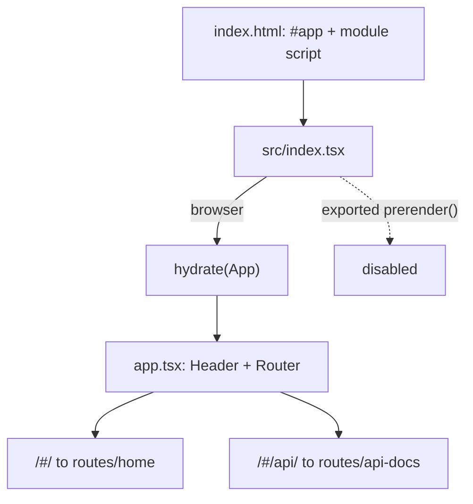

# Architecture

> A static, client-rendered Preact single-page app built with Vite and deployed to GitHub Pages. There is no backend.

## Stack at a Glance

| Layer                  | Choice                                                                          |
| ---------------------- | ------------------------------------------------------------------------------- |
| UI runtime and build   | Preact 10 + TypeScript (classic JSX, `h`), built by Vite 8 + `@preact/preset-vite` into `docs/` |
| Routing                | `preact-router` with `history`'s `createHashHistory`                             |
| Map and drawing        | MapLibre GL 6, Protomaps v3 light/dark styles, `terra-draw` 1.31.0 via `terra-draw-maplibre-gl-adapter` |
| Measurement and export | Turf `area`/`length`; JSON and FlatGeobuf export                                 |
| Styling                | Global CSS with `light-dark()` tokens plus per-component CSS Modules             |
| Tooling                | Playwright (Chromium only); ESLint 10 flat config; TypeScript 6 strict (`noEmit`) |

Non-obvious dependencies: `terra-draw` and `terra-draw-maplibre-gl-adapter` are exact pins rather than caret ranges; `preact-iso` provides `hydrate` and the `prerender`/`ssr` helper behind the inert exported `prerender()` (it is *not* the router); `flatgeobuf` is dynamically imported only when exporting `.fgb`; `@types/geojson` is types-only but misfiled under `dependencies`; Turf is re-exported through [`utils/geo.ts`](../src/utils/geo.ts) so components never import it directly.

## Rendering Pipeline

[`index.html`](../index.html) mounts `#app` and loads [`src/index.tsx`](../src/index.tsx) as a module script carrying the `prerender` attribute ([`index.html:20`](../index.html)). The entry imports the stylesheets and calls `hydrate(<App />, ...)` in the browser; [`app.tsx`](../src/components/app.tsx) renders the header and the router.

> [!NOTE]
> **Prerendering is disabled.** The `prerender` attribute and the exported `prerender()` are scaffolding only: [`vite.config.ts`](../vite.config.ts) calls `preact()` without options, and `@preact/preset-vite` defaults `prerender.enabled` to false, so the plugin never registers. Every build emits an empty `#app` shell and all rendering happens client-side via `hydrate`. Enabling it would fail in Node — `createHashHistory()` needs `window`, and the home route reads `localStorage` during render.

## Routing

Hash history makes the real URLs `/#/` (the map demo) and `/#/api/` (embedded TypeDoc), declared in [`app.tsx`](../src/components/app.tsx); this is what lets deep links work on GitHub Pages without server rewrites. The API route renders an `<iframe>` pointing at the externally generated TypeDoc site ([`api-docs/index.tsx`](../src/routes/api-docs/index.tsx)) — API docs are not built in this repo. The header links to `/api` while the route is declared `/api/`, which is cosmetic: preact-router strips leading and trailing slashes before matching. `<App />` also renders `
` inside the `#app` element from `index.html`, so the DOM has nested elements with the same id — harmless, but worth knowing when writing selectors.

## Conventions

- **Components** live in `src/components/<name>/` as `PascalCase.tsx` with a colocated `style.module.css`; **routes** are `src/routes/<name>/index.tsx` with route-local helpers as siblings; **shared helpers** live in [`src/utils/`](../src/utils/) and **assets** in [`src/assets/`](../src/assets/), imported directly for Vite to hash. Composables are `useXxx.ts` files next to their consumer (e.g. [`useDownloadJSON.ts`](../src/components/geojson-tab/useDownloadJSON.ts)); there is no global composables directory.
- Every `.tsx` imports `h` from `preact` because the classic JSX runtime is configured (`jsxFactory: "h"`); ESLint exempts `h` for the same reason. [`tsconfig.json`](../tsconfig.json) is `strict`/`noEmit`, aliases `react`/`react-dom` to `preact/compat` (so no React package is installed) and includes `src/**/*` only — the Vite and Playwright configs and the specs are not type-checked.

## Styling and Theming

- [`src/style/theme.css`](../src/style/theme.css) is the single palette, imported first by the entry. It sets `color-scheme: light dark` on `:root` and defines 44 role tokens as `light-dark(<light>, <dark>)` pairs, so the browser resolves every colour from `prefers-color-scheme` with no JavaScript. [`index.css`](../src/style/index.css) holds global resets, font and page background/text from the same tokens; per-component styling is CSS Modules, typed by the `*.css` declaration in [`declaration.d.ts`](../src/declaration.d.ts) and hashed/scoped by Vite. MapLibre's stylesheet is imported by the home route; routes are statically imported in [`app.tsx`](../src/components/app.tsx), so it lands in the single global stylesheet rather than a route chunk.
- To add a token, add a `light-dark()` declaration to `:root` and reference it with `var(--color-*)`. Set the light value to exactly the literal used before — distinct light values each keep their own token, so light mode stays byte-identical to the pre-theming build, guarded by [`dark-mode.spec.ts`](../tests/e2e/dark-mode.spec.ts). In dark mode the header marks are inverted and the map swaps Protomaps `white.json`→`black.json` live (see [Map and drawing](3.map-and-drawing.md)). There is no framework, preprocessor or theme toggle; `light-dark()` is Baseline 2024. `index.html` still loads Leaflet CSS ([`index.html:13`](../index.html)) — legacy, see quirks.

## Known Quirks and Tech Debt

1. **Inert prerender scaffolding** — the `prerender` attribute and exported `prerender()` do nothing while the preset option is disabled; enable it (and make the app Node-safe) or remove it.
2. **Dead PWA service worker** — [`src/sw.js`](../src/sw.js) imports from uninstalled `preact-cli/sw/`, and nothing registers it.
3. **Unused PWA manifest** — [`src/manifest.json`](../src/manifest.json) is never linked from `index.html`.
4. **Stale size artefact** — [`size-plugin.json`](../size-plugin.json) is preact-cli output from 2024; nothing produces or reads it.
5. **Leaflet CSS without Leaflet** — [`index.html:13`](../index.html) loads Leaflet CSS though MapLibre is the map stack: dead weight and an extra CDN request.
6. **Legacy `eslintConfig` block** — the old preact-cli config in `package.json` is ignored in favour of the flat config, and the config it extends is not installed.
7. **Types in production dependencies** — `@types/geojson` is types-only but listed under `dependencies`.
8. **Hardcoded Protomaps API key** — see the warning below.
9. **Dual router libraries** — `preact-iso` (hydrate) and `preact-router` (routing) are both runtime dependencies.
10. **Runtime CDN reliance** — Google Fonts, Leaflet CSS, the RTL text plugin and the Protomaps style/tile endpoints are external; the site is not self-contained.
11. **External API documentation** — the API tab iframes an external TypeDoc site; nothing here generates it.
12. **Typecheck scope** — `tsc --noEmit` covers `src/**/*` only, so the Playwright config and specs (which reference `process` without `@types/node`) are unchecked.

> [!WARNING]
> **Hardcoded key** — [`setup-maplibre.ts:65`](../src/routes/home/setup-maplibre.ts) embeds a Protomaps API key in source. It ships in the client bundle and can be scraped or exhausted. Rotate it in the Protomaps dashboard and inject it at build time instead.
