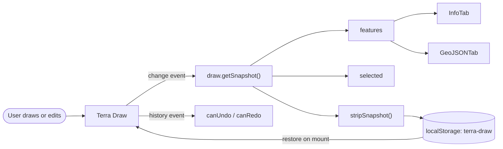

# Map and Drawing

> The home route (`/#/`) is the product: a full-screen MapLibre map with Terra Draw on top, a floating toolbar and a side panel for inspecting and exporting features.

All files below live under [`src/routes/home/`](../src/routes/home/) unless stated otherwise.

## Map Setup

[`setup-maplibre.ts`](../src/routes/home/setup-maplibre.ts) owns map creation. Terra Draw starts only after the style loads: the first effect creates the map and calls `setMap` inside `style.load`; the second constructs and starts Terra Draw when `map` changes. The adapter needs a fully loaded style before it can add sources and layers.

- **Worker and RTL plugin** — the MapLibre worker is imported as a Vite asset (`?worker&url`) and registered with `setWorkerUrl`; the RTL text plugin loads from unpkg on first use, a runtime CDN dependency.
- **Style and instance** — Protomaps v3 `white.json` (light) or `black.json` (dark) with the API key interpolated (see the key warning in [Architecture](2.architecture.md)); container `maplibre-map`, centre lat 30 / lng 0, zoom 3.

## Automatic Theming

The basemap follows `prefers-color-scheme` with no toggle. The initial style is chosen from `matchMedia` before the map is constructed, so a dark visitor never sees a light flash or first-load swap, and a `change` listener swaps styles live once the first `style.load` settles. `map.setStyle()` diffs the incoming style and removes programmatically added sources and layers — including Terra Draw's `td-*` features. The adapter has no `style.load` re-registration and `start()` early-returns once enabled, so [`preserveTerraDrawLayers`](../src/routes/home/setup-maplibre.ts) is passed as MapLibre's `transformStyle` option ([`setup-maplibre.ts:92`](../src/routes/home/setup-maplibre.ts)): it copies every `td-*` source and layer into the next style, appended after the basemap so draw features stay on top. [`dark-mode.spec.ts`](../tests/e2e/dark-mode.spec.ts) draws a polygon, point and marker after a live swap and checks all three survive the reverse swap — the image-backed `td-point-marker` layer is the sensitive one.

> [!NOTE]
> MapLibre logs an asynchronous `Image "…" could not be loaded` warning when the marker is first drawn. It reproduces in light mode with no swap and is not caused by the style change; the test fixture only fails on `error`/`pageerror`.

## Terra Draw Setup

[`setup-draw.ts`](../src/routes/home/setup-draw.ts) constructs the instance with `tracked: true` (Terra Draw stamps features with the `createdAt`/`updatedAt` the Info tab displays) and a `TerraDrawMapLibreGLAdapter` at `coordinatePrecision: 9` (~0.1 mm at the equator).

### Modes

Point, Rectangle, Circle and Marker use Terra Draw's defaults. The rest:

| Mode     | Class                     | Configuration                                        |
| -------- | ------------------------- | ---------------------------------------------------- |
| Select   | `TerraDrawSelectMode`     | Per-geometry drag/scale/rotate/midpoint/delete flags |
| Line     | `TerraDrawLineStringMode` | Rejects self-intersections on finish/commit          |
| Polyline | `TerraDrawPolyLineMode`   | Same validation as Line                              |
| Polygon  | `TerraDrawPolygonMode`    | `pointerDistance: 30`, self-intersection validation  |
| Freehand | `TerraDrawFreehandMode`   | `pointerDistance: 5`, validation on every update     |

Select is the most detailed: markers/points/circles/freehand are draggable; polygons are scaleable, rotateable and draggable with draggable deletable midpoints; lines and polylines are draggable with midpoints; rectangles are draggable and resizable from the opposite corner. Click-based modes validate self-intersections only at `finish`/`commit`, so drawing is never interrupted mid-way; freehand validates on every update. Undo/redo uses mode- and session-level stacks (`maxStackSize: 100`) with `Ctrl+Z` bound to undo, while Terra Draw's default redo shortcuts (`Ctrl+Shift+Z`, `Ctrl+Y`) remain active and redo is also available from the toolbar.

## Data Flow

`Home` holds all demo state: `map`, `draw`, current `mode`/`action`, `canUndo`/`canRedo`, panel `expanded`, `selected`, `features`, `tab` and export `format`.

The toolbar calls `draw.setMode(...)` via `changeMode` and `draw.undo()`/`draw.redo()` via `changeAction`; the latter also refreshes the undo/redo flags. A single effect subscribes to Terra Draw's `change` and `history` events: on `change` it takes `draw.getSnapshot()`, stores it in `features`, derives `selected` and persists a stripped copy; on `history` it syncs the flags. Clicking an Info-tab row switches Terra Draw to `select` mode and calls `draw.selectFeature(featureId, "select")`. Snapshots include transient guidance features (midpoints, selection points and similar): the GeoJSON tab shows the raw snapshot, while the Info tab filters guidance behind a toggle.

## Persistence

[`store-local-storage.ts`](../src/routes/home/store-local-storage.ts) is a small composable over `localStorage` under the key **`terra-draw`**. Persistence runs on every `change` through [`stripSnapshot`](../src/routes/home/strip-snapshot.ts), which drops selection points and midpoints, and resets `selected` so editing handles and pre-selection are never restored. On mount the stored JSON is parsed, loaded with `draw.addFeatures(parsed)` and followed by `draw.clearUndoRedoHistory()` — restored geometry is the baseline, cannot be undone away, and the redo stack starts empty. The active tab persists separately under `tab` ([`home/index.tsx:36`](../src/routes/home/index.tsx)); it is read during render, the main blocker to enabling prerendering (see [Architecture](2.architecture.md)).

## Toolbar

[`MapButtons.tsx`](../src/components/map-buttons/MapButtons.tsx) composes two floating groups. **Actions**: geolocation (only if `navigator.geolocation` exists), undo, redo and clear — undo/redo disabled from `canUndo`/`canRedo`, clear calling `draw.clear()`, removing the `terra-draw` key and resetting `features`, and geolocation flying the map to zoom 14 (alerting and logging on failure). **Modes**: select, point, linestring, rectangle, polygon, polyline, freehand, circle and marker, marking the active mode and deriving labels from the mode id unless one is passed; rectangle, freehand and circle are hidden on narrow viewports (under 900 px). Geolocation fails on insecure origins; `localhost` is a secure context, so it works over HTTP during development.
