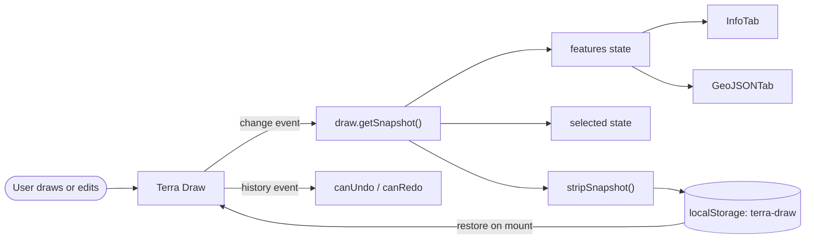

# Map and Drawing

> The home route (`/#/`) is the product: a full-screen MapLibre map with Terra Draw mounted on top, a floating toolbar and a side panel for inspecting and exporting features.

All files referenced here live under [`src/routes/home/`](../src/routes/home/) unless stated otherwise.

## Map Setup

[`setup-maplibre.ts`](../src/routes/home/setup-maplibre.ts) owns map creation:

- **Worker URL** — the MapLibre worker is imported as a Vite asset (`maplibre-gl/dist/maplibre-gl-worker.mjs?worker&url`, `setup-maplibre.ts:3`) and registered with `setWorkerUrl` (`setup-maplibre.ts:5`). The `*?worker&url` import is typed by [`declaration.d.ts:25-28`](../src/declaration.d.ts).
- **RTL text plugin** — loaded from unpkg on first use (`setup-maplibre.ts:58-63`) so right-to-left labels render. This is a runtime CDN dependency.
- **Style** — Protomaps v3, with the API key interpolated into the URL: `white.json` for light and `black.json` for dark (`setup-maplibre.ts:65-68`). See the key warning in [Architecture](2.architecture.md).
- **Map instance** — container id `maplibre-map`, centre latitude 30 / longitude 0, zoom 3, supplied by `mapOptions` in [`home/index.tsx:17-22`](../src/routes/home/index.tsx).

The home route defers starting Terra Draw until the style has loaded: the first effect creates the map and calls `setMap` only inside `style.load` ([`home/index.tsx:51-56`](../src/routes/home/index.tsx)); the second effect then constructs and starts Terra Draw whenever `map` changes (`home/index.tsx:58-66`). The adapter needs a fully loaded style before it can add its sources and layers.

### Automatic theming

The basemap follows the same `prefers-color-scheme` setting as the page; there is no toggle.

- **Initial load.** The style is chosen from `matchMedia("(prefers-color-scheme: dark)")` before the map is constructed (`setup-maplibre.ts:70-79`), so a dark visitor never sees a light flash or a first-load swap.
- **Live swap.** A `change` listener calls `map.setStyle()` with the other style, guarded until the map's first `style.load` settles; the listener is removed with the map (`setup-maplibre.ts:83-99`).
- **Preserving draw features.** `setStyle()` diffs the incoming style, which removes programmatically added sources and layers — including Terra Draw's `td-*` features. The adapter has no `style.load` re-registration and `TerraDraw.start()` early-returns once enabled, so [`preserveTerraDrawLayers`](../src/routes/home/setup-maplibre.ts) is passed as MapLibre's `transformStyle` option: it copies every `td-*` source and layer into the next style, appended after the basemap layers so draw features stay on top (`setup-maplibre.ts:7-45,92`).
- **Proving it.** [`dark-mode.spec.ts`](../tests/e2e/dark-mode.spec.ts) draws a polygon, a point and a marker after a live swap, then checks all three persist through the reverse swap. The marker matters most: its `td-point-marker` symbol layer uses an image rather than style JSON. Without the carry-over, the adapter's later `getSource(...).setData` throws and the console-error fixture fails the test.

> [!NOTE]
> MapLibre logs an asynchronous `Image "…" could not be loaded` warning when the marker is first drawn. It is pre-existing — it reproduces in light mode with no swap — and not a symptom of the style swap. The test fixture only fails on `error`/`pageerror`.

## Terra Draw Setup

[`setup-draw.ts`](../src/routes/home/setup-draw.ts) constructs the `TerraDraw` instance:

- `tracked: true` (`setup-draw.ts:24`) — Terra Draw stamps features with `createdAt`/`updatedAt`, which the Info tab displays. (This is also the store default; stating it explicitly documents the intent.)
- Adapter: `TerraDrawMapLibreGLAdapter` with `coordinatePrecision: 9` (`setup-draw.ts:25-28`) — nine decimal places, about 0.1 mm at the equator.

### Modes

| Mode         | Class                        | Configuration                                                                    |
| ------------ | ---------------------------- | -------------------------------------------------------------------------------- |
| Select       | `TerraDrawSelectMode`        | Per-geometry flags for dragging, scaling, rotating, midpoints and deletion       |
| Point        | `TerraDrawPointMode`         | Defaults                                                                          |
| Line         | `TerraDrawLineStringMode`    | Rejects self-intersections on finish/commit                                       |
| Polyline     | `TerraDrawPolyLineMode`      | Same validation as Line                                                           |
| Rectangle    | `TerraDrawRectangleMode`     | Defaults                                                                          |
| Polygon      | `TerraDrawPolygonMode`       | `pointerDistance: 30`, self-intersection validation on finish/commit              |
| Circle       | `TerraDrawCircleMode`        | Defaults                                                                          |
| Freehand     | `TerraDrawFreehandMode`      | `pointerDistance: 5`, self-intersection validation on every update                |
| Marker       | `TerraDrawMarkerMode`        | Defaults                                                                          |

The select flags (`setup-draw.ts:30-93`) are finer-grained than the other modes: markers/points/circles/freehand are draggable; polygons are scaleable, rotateable and draggable with draggable, deletable midpoints; lines and polylines are draggable with midpoints; rectangles are draggable and resizable from the opposite corner.

Validation (`setup-draw.ts:95-133`) uses Terra Draw's `ValidateNotSelfIntersecting`. Click-based modes only validate at `finish`/`commit` update types, so drawing is never interrupted mid-way; freehand's callback has no `updateType` gate and validates on every update.

### Undo/Redo

`undoRedo` (`setup-draw.ts:136-147`) configures three pieces:

- `TerraDrawModeUndoRedo` and `TerraDrawSessionUndoRedo`, both with `maxStackSize: 100` — mode-level and session-level stacks.
- `TerraDrawUndoRedoKeyboardShortcuts` with `Ctrl+Z` bound to undo. Redo is available from the toolbar.

## Data Flow

`Home` holds all demo state ([`home/index.tsx:26-41`](../src/routes/home/index.tsx)): `map`, `draw`, current `mode`/`action`, `canUndo`/`canRedo`, panel `expanded`, `selected`, `features`, `tab` and export `format`.

- **Commands in**: the toolbar calls `draw.setMode(...)` and `draw.undo()`/`draw.redo()` via `changeMode` and `changeAction` (`home/index.tsx:68-96`). `changeAction` also refreshes `canUndo`/`canRedo` immediately after an undo/redo.
- **State out**: a single effect subscribes to Terra Draw's `change` and `history` events (`home/index.tsx:115-147`). On `change`, it takes `draw.getSnapshot()`, stores it in `features`, derives `selected`, and persists a stripped copy. On `history`, it syncs the undo/redo flags.
- **Selection from the panel**: clicking a row in the Info tab calls `selectFeatureFromTable` (`home/index.tsx:98-113`), which switches Terra Draw to `select` mode and calls `draw.selectFeature(featureId, "select")`.
- **Cleanup**: the effect removes its listeners when dependencies change or the component unmounts (`home/index.tsx:142-145`).

Snapshots include Terra Draw's transient guidance features (midpoints, selection points and similar). The GeoJSON tab shows the raw snapshot; the Info tab filters guidance behind a toggle.

## Persistence

[`store-local-storage.ts`](../src/routes/home/store-local-storage.ts) is a small composable over `localStorage` with the key **`terra-draw`** (`store-local-storage.ts:7,13,19`). It exposes `getLocalStorage`, `setLocalStorage` and `clearLocalStorage`.

Persistence runs on every `change` event through [`stripSnapshot`](../src/routes/home/strip-snapshot.ts), which:

1. Drops guidance features (`selectionPoint`/`midPoint`, `strip-snapshot.ts:4-6`), so transient editing handles are never restored.
2. Resets the `selected` property (`strip-snapshot.ts:7-9`), so a feature does not come back pre-selected.

On mount, the stored JSON is parsed, loaded with `draw.addFeatures(parsed)` and followed by `draw.clearUndoRedoHistory()` (`home/index.tsx:132-138`). Restored geometry therefore becomes the baseline: it cannot be undone away, and the redo stack starts empty.

The active tab is persisted separately under the key `tab` (`home/index.tsx:35-46`) — a distinct mechanism from the Terra Draw store, but the same browser storage. Note that it is read during render, which is the main blocker to enabling prerendering (see [Architecture](2.architecture.md)).

## Toolbar

[`MapButtons.tsx`](../src/components/map-buttons/MapButtons.tsx) composes the two floating button groups:

- **Actions** (`MapButtons.tsx:35-60`): geolocation (only if `navigator.geolocation` exists), undo, redo and clear.
  - [`MapActionButton.tsx`](../src/components/map-button/MapActionButton.tsx) renders undo/redo, disabled from `canUndo`/`canRedo`.
  - [`ClearButton.tsx`](../src/components/clear-button/ClearButton.tsx) calls `draw.clear()`, clears the `terra-draw` storage key and resets the `features` state (`ClearButton.tsx:23-27`).
  - [`GeolocationButton.tsx`](../src/components/geolocation-button/GeolocationButton.tsx) calls `navigator.geolocation.getCurrentPosition` and hands `[longitude, latitude]` back to the route, which flies the map to zoom 14 (`home/index.tsx:163-170`). A failure alerts and logs.
- **Modes** (`MapButtons.tsx:62-93`): select, point, linestring, rectangle, polygon, polyline, freehand, circle and marker. [`MapButton.tsx`](../src/components/map-button/MapButton.tsx) marks the active mode and derives labels from the mode id with `titleCase` unless an explicit label is passed. Rectangle, freehand and circle are hidden on touch devices (`hiddenOnMobile`).

Geolocation fails on insecure origins; `localhost` is a secure context, so it works during development over HTTP — see [Getting started](1.start.md).

The toolbar's colours come from dedicated `--color-map-control-*` tokens rather than the page-chrome tokens, so the controls stay visible over the dark basemap — see [Architecture](2.architecture.md#theming).

## Related

- [Architecture](2.architecture.md) — routing, conventions and quirks.
- [Export and measurement](4.export-and-measurement.md) — what happens to the snapshot once it reaches the side panel.
