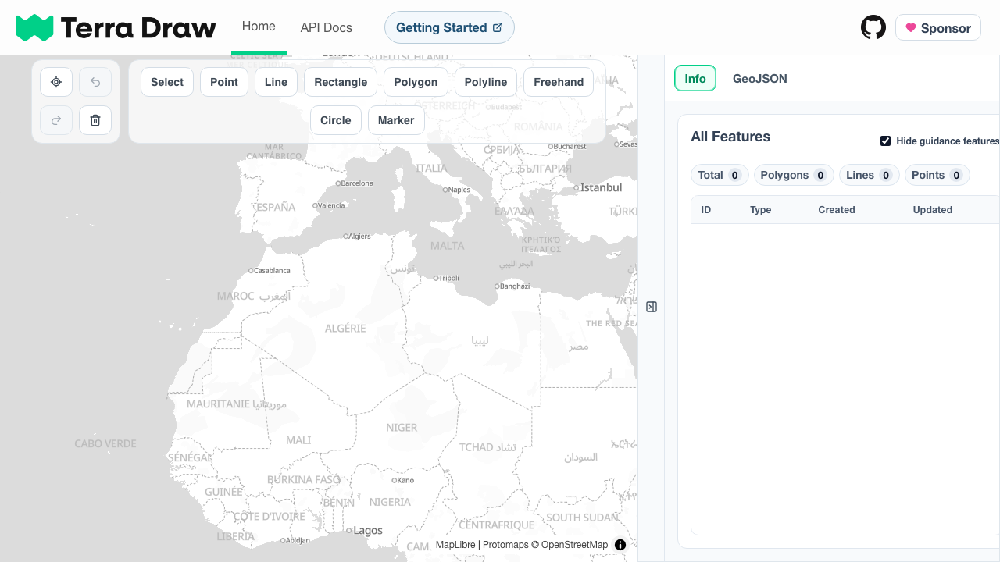
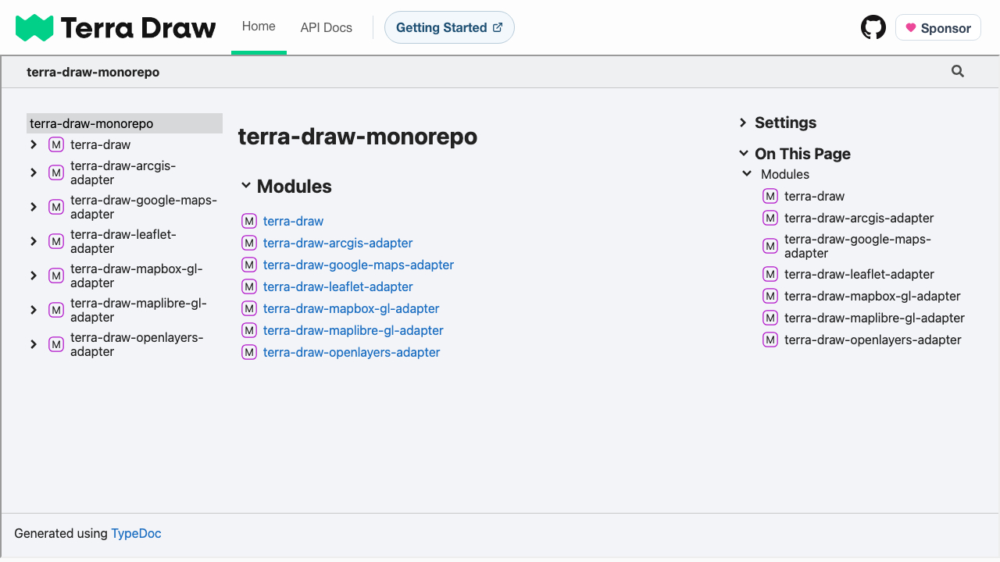

# Testing

> Twenty-one Playwright tests exercise the production build end to end — per-screen smoke checks, UI-driven drawing and measurements, undo/redo/clear, both export formats, automatic light/dark theming and README captures regenerated on every run — and any console error fails the test that produced it.

## Overview

Playwright runs Chromium only against the production build: its `webServer` block runs `npm run build` before `vite preview`, so tests check the real bundle. Every spec imports the fixture-extended `test` (and `expect`) from [`tests/e2e/fixtures.ts`](../tests/e2e/fixtures.ts), which applies three `{ auto: true }` fixtures. One of the 21 tests is an intentional `test.fail()`, so the suite still exits 0.

### Suite Structure

| Spec                                                                  | Tests | Coverage                                                                                        |
| --------------------------------------------------------------------- | ----- | ----------------------------------------------------------------------------------------------- |
| [`smoke.spec.ts`](../tests/e2e/smoke.spec.ts)                          | 2     | Home and API docs screens render; screenshots regenerated                                        |
| [`drawing.spec.ts`](../tests/e2e/drawing.spec.ts)                      | 3     | UI-driven drawing with measurements, GeoJSON content, undo/redo/clear                            |
| [`export.spec.ts`](../tests/e2e/export.spec.ts)                        | 2     | GeoJSON and FlatGeobuf downloads                                                                 |
| [`dark-mode.spec.ts`](../tests/e2e/dark-mode.spec.ts)                  | 10    | Light palette guards, dark chrome and basemap, committed dark capture, live swaps                 |
| [`fixture-self-test.spec.ts`](../tests/e2e/fixture-self-test.spec.ts)  | 3     | Meta-tests for the console-error and storage-isolation fixtures and the blank-capture guard       |
| [`demo-screenshot.spec.ts`](../tests/e2e/demo-screenshot.spec.ts)      | 1     | README demo captures (light and dark), regenerated on every run                                 |

## Fixtures and Policy

[`fixtures.ts`](../tests/e2e/fixtures.ts) provides three auto-applied fixtures:

- **`failOnConsoleError`** — collects every `error` console message and uncaught `pageerror`, then fails the test during teardown with the page URL and messages. Warnings are logged but never fail.
- **`cleanStorage`** — removes the app's `localStorage` keys (`terra-draw` feature snapshot and `tab` active panel) before app scripts run on every navigation, so each test starts from the default state.
- **`mapTileTracker`** — records finished Protomaps tile requests per page on `requestfinished` (not `response`, which fires before the body completes); `getMapTileUrls(page)` exposes the list.

Specs must import `test`/`expect` from `./fixtures`, not `@playwright/test`. `fixtures.ts` also exports `captureScreenshot(page, path)`, which gates on map rendering and validates the captured bytes before writing: it retries the transient WebGL readback races (a successful-looking screenshot with blank map pixels), decoding each attempt and counting exact colours in a chrome-free band of the map, and nudges MapLibre to repaint on a blank result. The file is written only after validation, so a blank capture never reaches disk; `smoke`, `demo-screenshot` and `dark-mode` all use it.

Readiness is event-based and never waits for `networkidle`; the capture-recovery nudge uses a bounded 150 ms timeout with backoff. The readiness signal is the `#select` toolbar button, which renders only once Terra Draw exists — and Terra Draw is constructed only after MapLibre's `style.load`. That proves the real pipeline ran, not that tiles painted; `captureScreenshot` adds a harder gate of at least four finished tiles and more than ten distinct quantised colours in a downscaled canvas capture, both with a 30 s loud timeout.

> [!NOTE]
> Routine non-fatal warnings on healthy runs: `GPU stall due to ReadPixels`, the cross-origin iframe's `Setting overlaysContent …`, and MapLibre's `Image "…" could not be loaded` on first marker draw. The demo spec also emits MapLibre `Max vertices per segment is 65535` warnings for its 69,577-coordinate line; it still renders. The fixture fails on `error`/`pageerror` only.

## Coverage

Smoke tests write viewport screenshots (both screens fit the viewport) to the tracked [`documentation/screenshots/`](screenshots/) directory and attach them to the report. The home test checks title, nav links, tabs, panel button and the empty default table; the API docs test checks one visible `iframe` pointing at the external TypeDoc URL (its cross-origin content is not asserted).

Drawing is UI-driven: modes are clicked in the toolbar, vertices on the canvas, shapes finished with `Enter`, all clear of the toolbar, panel and attribution. The drawing spec covers polygon (area/coordinates), line (length) and undo/redo/clear (including the emptied `terra-draw` key). The export spec checks downloaded filenames and contents — GeoJSON parses back to a `FeatureCollection` identical to the textarea, FlatGeobuf carries the `fgb` magic bytes and version 3. The theming spec pins exact light colours, asserts dark surfaces on both routes, checks the first load requests `black.json`, and flips the scheme live (`white.json → black.json → white.json`). [`fixture-self-test.spec.ts`](../tests/e2e/fixture-self-test.spec.ts)'s three meta-tests prove the console-error fixture (via an intentional `test.fail()`), the storage-isolation fixture and the blank-capture rejection. [`demo-screenshot.spec.ts`](../tests/e2e/demo-screenshot.spec.ts) regenerates [`demo-light.png`](screenshots/demo-light.png) and [`demo-dark.png`](screenshots/demo-dark.png) (both 1440×900) on every suite run from a single Terra Draw-native LineString seeded into the `terra-draw` key, framed deterministically, with the light capture taken before the live style swap and the dark capture after it. Its fixture is [`tests/data/big-route.geojson`](../tests/data/big-route.geojson): one 2D LineString of 69,577 coordinates with `properties.mode: "linestring"`; regenerate just these captures with `npx playwright test tests/e2e/demo-screenshot.spec.ts`.

## Running the Tests

Install Playwright's Chromium once (see [Getting started](1.start.md)), then run `npm test`, which starts `npm run build && npx vite preview --host 127.0.0.1 --port 4173 --strictPort` and waits for `http://127.0.0.1:4173` with a 120 s budget. Locally an existing server on 4173 is reused (`reuseExistingServer: !process.env.CI`); in CI a fresh one always starts.

> [!WARNING]
> `npm test` starts with `npm run build`, so it wipes and rewrites `docs/` — the Vite build output, not documentation.

> [!NOTE]
> Because of `reuseExistingServer`, a stale preview on port 4173 is reused as-is; stop any running preview before a verification run.

### Configuration

| Setting         | Value                                   |
| --------------- | --------------------------------------- |
| `testDir`       | `./tests/e2e`                           |
| Projects        | Chromium (Desktop Chrome)               |
| `baseURL`       | `http://127.0.0.1:4173`                 |
| Test timeout    | 30 s                                    |
| Expect timeout  | 10 s                                    |
| `fullyParallel` | `false`                                 |
| Retries         | 2 in CI, 0 locally                      |
| Workers         | 1 in CI, default locally                |
| Reporter        | `list` locally; `github` + `list` in CI |
| Trace           | `on-first-retry`                        |
| `webServer`     | build + preview on port 4173            |

## CI and Debugging

The `build` job in [`.github/workflows/ci.yml`](../.github/workflows/ci.yml) (Ubuntu 24.04, Node `24.18.0`) runs `npm ci`, installs Chromium, builds, then runs `npm test` — the step is still labelled `Production Build Smoke Test`. The separate `lint`, `package-lock` and `typecheck` jobs cover style and types; the deploy workflow has no test step.

Use `npx playwright test --headed` to watch, `--debug` for the Inspector (`--timeout=0` disables timeouts while stepping), or `await page.pause()` in a spec. Readiness is gated on `#select`, vertices are clicks inside `#maplibre-map`, and this Terra Draw version has no double-click-to-finish — `Enter` finishes polygon/line shapes and `Escape` cancels. Traces land in gitignored `test-results/`, reports in `playwright-report/`.

## Caveats

- **Specs are not type-checked** — `npm run typecheck` covers `src/**/*` only, so `playwright.config.ts` and the specs (which reference `process` without `@types/node`) are outside the program.
- **External runtime dependencies** — map readiness needs the Protomaps style endpoint and API key, and map tests need egress for tile bodies; a blocked endpoint fails runs loudly rather than committing a blank asset. The API iframe is cross-origin and never asserted.
- **Area units vary with zoom** — `InfoTab` switches from m² to km² at 1,000,000 m²; at default zoom a screen-visible polygon is always ≥ 1 km², so the drawing spec accepts either unit.
- **Dense features stall selection** — clicking the demo's 69,577-coordinate row never completes (select mode creates ~2 guidance features per coordinate), so both demo captures are taken unselected. App behaviour, not a test defect.
- **Stale preview reuse** — `reuseExistingServer` reuses whatever listens on 4173 locally.
- **Demo captures are not byte-reproducible** — Terra Draw stamps `createdAt`/`updatedAt` as the seeded fixture loads and the Info table renders them, so the demo PNGs differ run to run in that region; basemap labelling can occasionally vary too.
